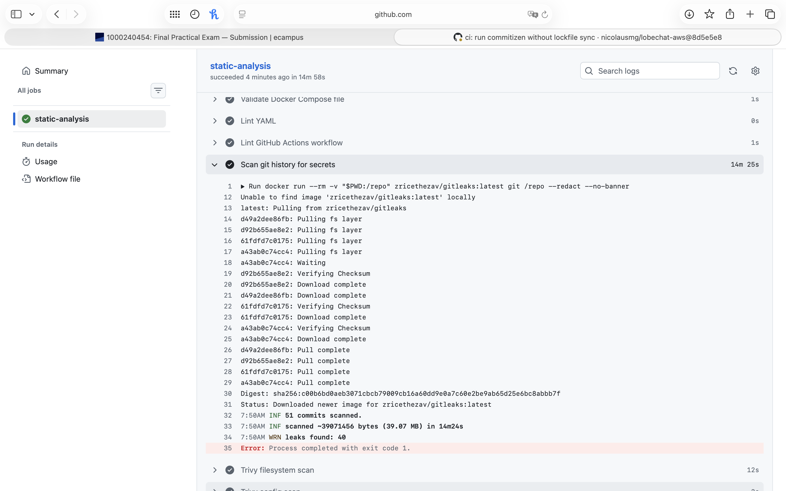

# CI reasoning

## Evidence

- **Actions run URL:** <https://github.com/nicolausmg/lobechat-aws/actions/runs/26870569222>
- **Workflow run:** `CI` / `static-analysis`
- **Branch:** `final-exam`
- **Executed commit SHA:** `8d5e5e84640f2295e94ed986d9f4c73d9b622eaa`
- **Commit message:** `ci: run commitizen without lockfile sync`
- **Result:** success, with warn-only annotations from baseline findings
- **Run duration:** 15m 3s

The screenshot above is from my own fork, `nicolausmg/lobechat-aws`, and shows the `final-exam` branch, commit `8d5e5e8`, the `static-analysis` job, and individual gates such as Compose validation, YAML linting, GitHub Actions linting, gitleaks, Trivy filesystem scan, and Trivy config scan.

## What was built

I added the repository's first CI workflow at `.github/workflows/ci.yml`. It runs on `push`, `pull_request`, and manual `workflow_dispatch` (`.github/workflows/ci.yml:3-6`). The job uses a standard GitHub-hosted Ubuntu runner (`.github/workflows/ci.yml:8-10`) and checks out full git history with `fetch-depth: 0` (`.github/workflows/ci.yml:17-20`) because `gitleaks` and Commitizen's `origin/main..HEAD` range both need history.

The pipeline is intentionally build-free. It validates and scans the files that already exist in this repository, but it does not run `docker build`, `docker compose up`, `docker compose run`, `pytest`, or deployment commands. That matters because this repo is an 11-service stack in `docker-compose.yml`, not a small unit-test-only app. The services include `caddy`, `casdoor`, `lobe-chat`, `mcphub`, `qdrant`, `hayhooks`, `hayhooks-mcp`, `vllm`, `minio`, `linux-sandbox`, and `postgres` (`docker-compose.yml:2`, `docker-compose.yml:25`, `docker-compose.yml:43`, `docker-compose.yml:102`, `docker-compose.yml:145`, `docker-compose.yml:160`, `docker-compose.yml:174`, `docker-compose.yml:188`, `docker-compose.yml:223`, `docker-compose.yml:244`, `docker-compose.yml:256`). The `vllm` service is explicitly GPU-profiled (`docker-compose.yml:188-192`), requests an NVIDIA GPU (`docker-compose.yml:208-214`), and has a 300-second healthcheck start period (`docker-compose.yml:216-221`). A GitHub-hosted runner is not the right place to start that system.

The workflow's comment makes that scope explicit: `tests/` are live-stack integration tests and are deliberately excluded (`.github/workflows/ci.yml:13-15`). The concrete evidence is `tests/test_vllm.py`: it imports `httpx` and `openai` (`tests/test_vllm.py:9-11`), defaults to `http://localhost:47007/v1` (`tests/test_vllm.py:13`), hits `/health` over HTTP (`tests/test_vllm.py:30-34`), and uses OpenAI-compatible chat/model endpoints (`tests/test_vllm.py:36-47`, `tests/test_vllm.py:53-65`). Those are not offline unit tests; they require a live vLLM endpoint and therefore belong in a later ephemeral-environment stage, not in this first static CI.

## Design choice: warn-only vs blocking

I made syntax and structural checks blocking, but made baseline security/hardening scanners warn-only. The workflow documents that rollout choice in `.github/workflows/ci.yml:44-47`. The reason is practical and honest: this repo already contains real findings, and the first CI should surface them without making the first adoption step unusable. A green run with visible warnings is not the same as pretending the repo is clean; it means the gates ran, produced evidence, and did not hide known baseline debt.

Blocking gates:

- `docker compose -f docker-compose.yml config -q` is blocking because if Compose cannot parse or interpolate the stack, the repository's main deployment descriptor is structurally invalid (`.github/workflows/ci.yml:62-63`).
- `yamllint` and `actionlint` are blocking for workflow/YAML validity because a broken workflow gives no useful security signal (`.github/workflows/ci.yml:65-72`).
- Commitizen is blocking because it checks the new commit range and prevents this CI work from bypassing the repo's own contribution convention (`.github/workflows/ci.yml:95-105`).

Warn-only gates:

- Hadolint is warn-only (`.github/workflows/ci.yml:48-60`) because the Dockerfiles contain known hardening debt. The run still reported it: for `dockerfiles/mcphub.Dockerfile`, Hadolint flagged the `latest` base image, final `USER root`, and unpinned apt packages. For `dockerfiles/sandbox.Dockerfile`, Hadolint reached the file but could not fully parse the existing heredoc around `dockerfiles/sandbox.Dockerfile:68-74`; I treat that as a real limitation/finding to document, not as a reason to edit the Dockerfile during the exam.
- `gitleaks` is warn-only (`.github/workflows/ci.yml:74-79`) because historical secret scanning can surface findings that need careful triage. The run reported potential leaks, but I do not claim that this means current live runtime secrets are committed. The repo already protects current secret-bearing files through `.gitignore`: `.env`, `deploy/.env.local`, `db/flyway/.env.flyway`, `aws_credentials.yaml`, `*.pem`, and `config/ssh/` are ignored (`.gitignore:7-10`, `.gitignore:19-28`).
- Trivy filesystem and config scans are warn-only (`.github/workflows/ci.yml:81-93`) because they are expected to report dependency and misconfiguration debt on the first run. The run did show concrete misconfigurations in `deploy/cloudformation.yml` and both Dockerfiles, which is useful evidence for the next remediation cycle.

## Compose interpolation and secret safety

`docker-compose.yml` uses required environment variables that are intentionally not committed as real secrets, for example `NEXT_AUTH_SECRET` (`docker-compose.yml:58`), `AUTH_CASDOOR_ID` (`docker-compose.yml:63`), `AUTH_CASDOOR_SECRET` (`docker-compose.yml:64`), `KEY_VAULTS_SECRET` (`docker-compose.yml:76`), `OPENROUTER_API_KEY` (`docker-compose.yml:78`), `OPENAI_API_KEY` (`docker-compose.yml:82`), `HF_TOKEN` (`docker-compose.yml:196`), SSH settings (`docker-compose.yml:112-119`), and `OPENAPI_MCP_HEADERS` (`docker-compose.yml:123-124`). Without placeholders, `docker compose config -q` would fail before it could validate the Compose schema.

The CI fixes that by copying `.env.example` to `.env` inside the runner and adding a dummy `OPENAPI_MCP_HEADERS` value (`.github/workflows/ci.yml:38-42`). That is safe because `.env.example` explicitly says its values are not real secrets (`.env.example:3-6`) and contains placeholder values such as `your-casdoor-app-id`, `your-casdoor-app-secret`, `sk-or-v1-your-openrouter-api-key`, `sk-your-openai-api-key`, and `hf_your-huggingface-token` (`.env.example:27-29`, `.env.example:46-53`). The real `.env` file is ignored by git (`.gitignore:7-8`), so CI can create it at runtime without adding credentials to the repository.

## Part A: Why each gate matters in this repository

| Gate | Repo-specific risk it catches | Evidence from this repo |
|---|---|---|
| Compose config validation | The whole system is orchestrated through `docker-compose.yml`, so a schema or interpolation error would break deployment before any container starts. This repo has many required secret variables and nested defaults, so static Compose validation is the right minimum gate. | Required secret/interpolation variables appear across `lobe-chat` and `mcphub`: `NEXT_AUTH_SECRET`, `AUTH_CASDOOR_ID`, `AUTH_CASDOOR_SECRET`, `KEY_VAULTS_SECRET`, `OPENROUTER_API_KEY`, `OPENAI_API_KEY`, SSH variables, and `OPENAPI_MCP_HEADERS` (`docker-compose.yml:58-64`, `docker-compose.yml:76-82`, `docker-compose.yml:112-124`). The CI prepares placeholders before running `docker compose -f docker-compose.yml config -q` (`.github/workflows/ci.yml:38-42`, `.github/workflows/ci.yml:62-63`). |
| Hadolint on both Dockerfiles | The repo has two locally built images, and both are part of the runtime graph. Linting only one would miss half of the local image hardening surface. | `mcphub` is built from `dockerfiles/mcphub.Dockerfile` (`docker-compose.yml:102-106`), and `linux-sandbox` is built from `dockerfiles/sandbox.Dockerfile` (`docker-compose.yml:244-248`). `mcphub.Dockerfile` starts from `samanhappy/mcphub:latest` (`dockerfiles/mcphub.Dockerfile:1`), runs as root (`dockerfiles/mcphub.Dockerfile:5`), and installs `gcc` plus `docker.io` into a runtime image (`dockerfiles/mcphub.Dockerfile:6-8`). `sandbox.Dockerfile` gives the `oriol` user passwordless sudo (`dockerfiles/sandbox.Dockerfile:18-22`) and downloads tools from moving "latest" endpoints (`dockerfiles/sandbox.Dockerfile:41-50`, `dockerfiles/sandbox.Dockerfile:55-63`). |
| Trivy config scan | The repo includes Dockerfiles, Compose, and CloudFormation. Misconfiguration scanning matters because security posture here is not only package CVEs; it includes AWS networking, metadata, root users, image tags, healthchecks, and insecure service configuration. | The run reported CloudFormation findings in `deploy/cloudformation.yml`, including public IP association on the public subnet (`deploy/cloudformation.yml:69-75`) and EC2 instance metadata-token posture around the instance resource (`deploy/cloudformation.yml:142-164`). It also reported Dockerfile findings in `dockerfiles/mcphub.Dockerfile:1` and `dockerfiles/mcphub.Dockerfile:5`. The Compose file also has configuration risks that belong in this class of check: Casdoor connects to Postgres with `sslmode=disable` (`docker-compose.yml:35-36`), LobeChat's `DATABASE_URL` does not request TLS (`docker-compose.yml:54-55`), and several secrets are passed as plaintext environment variables (`docker-compose.yml:58`, `docker-compose.yml:63-64`, `docker-compose.yml:71-78`, `docker-compose.yml:82`). |
| Trivy filesystem scan | This repository vendors multiple scripts, SQL migrations, Dockerfiles, and deployment assets. A filesystem scan gives a first vulnerability/dependency pass without building images or running services. | The scan covers the whole checked-out tree with `trivy fs .` (`.github/workflows/ci.yml:81-86`), including Dockerfiles, deployment scripts, and DB tooling. That matters because runtime images are assembled from `dockerfiles/mcphub.Dockerfile` and `dockerfiles/sandbox.Dockerfile`, while deployment tooling lives under `deploy/` and `scripts/`. |
| gitleaks | The stack is secret-heavy: auth, SSO, S3, OpenRouter/OpenAI, Hugging Face, SSH, AWS, and MinIO all depend on credentials. The right check is a history-aware scan, not just checking current files, because leaked credentials can live in old commits. | Secrets enter Compose as plaintext environment variables (`docker-compose.yml:58`, `docker-compose.yml:63-64`, `docker-compose.yml:71-78`, `docker-compose.yml:82`, `docker-compose.yml:112-127`, `docker-compose.yml:196`). The repo tries to keep real secrets out with `.gitignore` (`.gitignore:7-10`, `.gitignore:19-28`). CI checks full history by using `fetch-depth: 0` (`.github/workflows/ci.yml:17-20`) and then runs `gitleaks` (`.github/workflows/ci.yml:74-79`). |
| yamllint | The main stack descriptor and CI workflow are YAML. If they do not parse, the rest of the pipeline is meaningless. I kept this gate focused on YAML validity so the first CI does not require unrelated style edits to the existing Compose file. | The workflow lints at least `docker-compose.yml` and `.github/workflows/ci.yml` (`.github/workflows/ci.yml:65-69`). The earlier CI run caught existing style annotations in `docker-compose.yml`, which is useful, but I did not change application config just to satisfy formatting. |
| actionlint | GitHub Actions syntax errors fail before any scanner runs. This already happened once with the inline `yamllint` command; `actionlint` exists to catch workflow problems before students wait on a broken run. | The workflow runs `actionlint` after installing it (`.github/workflows/ci.yml:30-36`, `.github/workflows/ci.yml:71-72`). The workflow itself uses pinned marketplace action tags for checkout, Python, and uv (`.github/workflows/ci.yml:17-28`). |
| Commitizen | The repo already has a local Conventional Commits gate. CI should mirror that local rule instead of inventing a different convention or checking the entire legacy history. | Commitizen is configured in `[tool.commitizen]` (`pyproject.toml:17-25`). The local hook runs `uv run cz check --commit-msg-file` (`.githooks/commit-msg:10-13`). CI mirrors that gate with a bounded range, `origin/main..HEAD`, because existing history may include older non-conventional commits (`.github/workflows/ci.yml:95-105`). |

## Why this is CI, not CD

This workflow is Continuous Integration: it checks whether proposed repository changes satisfy static quality, syntax, security, and commit-message gates. It does not build deployable artifacts, publish images, mutate AWS, migrate databases, promote environments, or verify a live deployment. That is intentional for this exam deliverable. The workflow gives fast feedback about repository health, but it stops before Continuous Delivery or Continuous Deployment.

The gap matters because this repo's production unit is not a single binary. It is a Compose stack with externally pulled images, locally built images, database state, runtime secrets, reverse-proxy requirements, and AWS infrastructure. A production pipeline would need to control all of those release inputs before it could safely deploy.

## Part B: What is missing for real production CI/CD

1. **Build, push, sign, and attach SBOMs for local images.** Today, `mcphub` and `linux-sandbox` are locally built through Compose (`docker-compose.yml:102-106`, `docker-compose.yml:244-248`) and tagged as `lobechat-aws-mcphub:latest` and `lobechat-aws-linux-sandbox:latest` (`docker-compose.yml:106`, `docker-compose.yml:248`). A real CD pipeline should build those Dockerfiles in CI, push them to a registry such as ECR, sign the images, generate SBOMs, and deploy by digest. That would make the deployed artifact auditable and reproducible instead of depending on whatever was last built on an EC2 host.

2. **Resolve floating images to immutable digests.** The current stack pulls moving or insufficiently pinned images: `lobe-chat` has no tag at all (`docker-compose.yml:43-44`), `qdrant` uses `qdrant/qdrant:latest` (`docker-compose.yml:145-146`), `minio` uses `minio/minio:latest` (`docker-compose.yml:223-224`), and `mcphub.Dockerfile` starts from `samanhappy/mcphub:latest` (`dockerfiles/mcphub.Dockerfile:1`). The Compose `mcphub` service itself is built locally (`docker-compose.yml:102-106`), so the unpinned pull risk is specifically the Dockerfile `FROM`, not the Compose service image label. For production CD, every upstream image should be pinned to a digest and updated deliberately through pull requests.

3. **Use GitHub OIDC for AWS access instead of standing credentials.** The current runtime pattern mounts host AWS credentials into `mcphub` (`docker-compose.yml:120-133`), and `.env.example` still documents optional static AWS credential variables (`.env.example:69-72`). A production pipeline should federate GitHub Actions to AWS with OIDC and least-privilege IAM roles. That means CI carries no long-lived AWS keys, and deploy permissions are scoped to the exact account, region, stack, ECR repos, and secret paths it needs.

4. **Inject secrets at deploy time from SSM Parameter Store or Secrets Manager.** The final-project constraints explicitly require `.env` to be populated via SSM Parameter Store or AWS Secrets Manager and no secrets in git (`docs/FINAL-PROJECT.md:26-32`). This repo's deployment docs also identify Secrets Manager as the preferred path, with a local fallback only because the course sandbox may deny those writes (`deploy/README.md:14-18`). CD should promote only references to secrets, not rendered secret values. Compose currently passes many secrets as environment variables (`docker-compose.yml:58`, `docker-compose.yml:63-64`, `docker-compose.yml:71-78`, `docker-compose.yml:82`, `docker-compose.yml:124-127`, `docker-compose.yml:196`), so production deployment must source those values from a controlled secret backend at release time.

5. **Add a database migration stage with approval around destructive operations.** The repo has a real Flyway migration toolchain for `lobechat`, `casdoor`, and `litellm` (`db/flyway/provision.sh:1-17`). It can run migrations (`db/flyway/provision.sh:73-85`), but it can also run `clean`, which drops data/reset history after a prompt (`db/flyway/provision.sh:68-72`). A production CD pipeline should make migrations a distinct stage: render migrations, show Flyway info, run non-destructive migrations automatically in lower environments, and require protected-environment approval for any destructive clean/reset operation.

6. **Implement dev to stage to prod promotion with protected environments.** The final-project architecture question requires a dev, stage, prod evolution and a promotion flow with branching, tagging, and approvals (`docs/FINAL-PROJECT.md:75-86`). This CI workflow currently runs one static job on pushes/PRs; it does not know which environment is being promoted. Real CD should define environment-specific deploy jobs, require manual approval for production, and promote the same immutable image digests and migration set from dev to stage to prod.

7. **Deploy to the target without exposing the raw app port.** The final-project rules require the app to be exposed through a reverse proxy or managed edge with HTTPS (`docs/FINAL-PROJECT.md:30-32`) and state that a raw IP on port 47000 is not production posture (`docs/FINAL-PROJECT.md:161-163`). The Compose file maps LobeChat only to localhost `127.0.0.1:${LOBECHAT_PORT:-47000}:3210` (`docker-compose.yml:46-47`), and Caddy depends on `lobe-chat`, `casdoor`, and `minio` (`docker-compose.yml:19-22`). A production pipeline should deploy through SSM Run Command or a controlled SSH/agent path, run `compose pull`/restart using pinned artifacts, and verify that public traffic reaches only 80/443 through the proxy while direct `:47000` access remains closed.

8. **Add post-deploy smoke tests against an ephemeral or promoted environment.** The tests in `tests/` are not suitable for build-free CI because they require live services, but they are exactly the kind of smoke tests a CD pipeline should run after deploying an environment. `tests/test_vllm.py` hits `/health` (`tests/test_vllm.py:30-34`), lists models through the OpenAI client (`tests/test_vllm.py:36-47`), and sends chat completions (`tests/test_vllm.py:53-65`). Those should run after an ephemeral stack or stage deployment exists. The production pipeline should also add health gates for services that lack strong health coverage; for example, `lobe-chat`, `mcphub`, `hayhooks`, `hayhooks-mcp`, and `linux-sandbox` depend mostly on `restart`/`depends_on` rather than explicit healthchecks (`docker-compose.yml:91-100`, `docker-compose.yml:136-143`, `docker-compose.yml:169-186`, `docker-compose.yml:244-254`).

9. **Replace the bind-mounted LobeChat monkeypatch with a forked, versioned image.** The app currently bind-mounts a committed hotfix over LobeChat internals: `./patches/route.js` is mounted directly into `.next/server/.../route.js` (`docker-compose.yml:48-50`). That is fragile CD because the patch must match the exact upstream application build layout. A production pipeline should bake that patch into a forked, pinned LobeChat image, test it, sign it, and deploy it by digest so rollback is a normal image rollback rather than a mystery combination of upstream image plus local file overlay.

10. **Add branch protection, required checks, signed release tags, and rollback.** Commitizen already knows the project version and final tag format (`pyproject.toml:17-25`), but this workflow does not enforce branch protection or release signing. A production pipeline should require the CI checks before merging to `main`, create signed release tags such as `final-vX.Y.Z`, keep previous image digests available, and automate rollback when smoke tests fail. That matters especially because current deployment includes floating images (`docker-compose.yml:43-44`, `docker-compose.yml:145-146`, `docker-compose.yml:223-224`) and a bind-mounted patch (`docker-compose.yml:48-50`), both of which make "what is deployed?" harder to answer after an incident.

## Highest-value next step

The single highest-value next step is to build and publish immutable, signed images for the locally controlled runtime pieces, then deploy those images by digest. This repository currently mixes local builds (`docker-compose.yml:102-106`, `docker-compose.yml:244-248`), `:latest` tags (`docker-compose.yml:106`, `docker-compose.yml:146`, `docker-compose.yml:224`, `docker-compose.yml:248`), and a bind-mounted LobeChat patch (`docker-compose.yml:48-50`). Until the deployment artifact is reproducible, secrets, migrations, smoke tests, and approvals still rest on an unstable foundation. Once image identity is fixed, the rest of CD can promote the same artifact through dev, stage, and prod with much less ambiguity.

## Final assessment

This CI workflow is deliberately modest, but it is meaningful. It proves that the repository can run static checks on a standard GitHub runner without starting the heavy stack. It validates Compose interpolation safely with placeholder `.env.example` values, mirrors the existing Commitizen convention, scans secrets/history, lints Dockerfiles and YAML, and runs Trivy in both filesystem and config modes. The resulting run is green because baseline scanners are warn-only, but it is not empty: it surfaces real hardening and misconfiguration findings that should drive the next work. That is the correct first CI step for this repository; a real production delivery pipeline would come next, with immutable images, OIDC, secret injection, migrations, environment promotion, smoke tests, and rollback.
