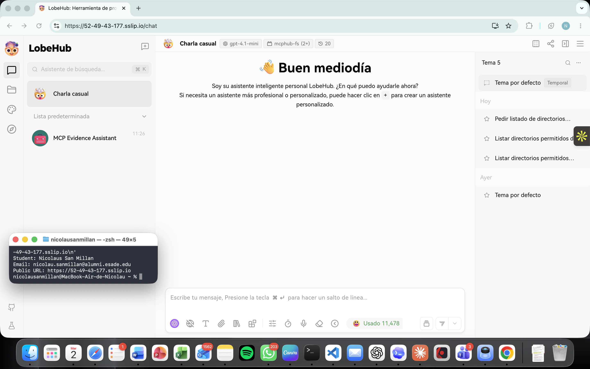
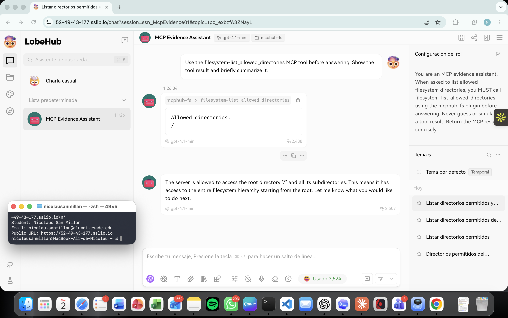

# Final Project — Evidence Report

## 1. Identity

| Field | Value |
|---|---|
| Student name | Nicolau San Millán |
| ESADE email | nicolau.sanmillan@alumni.esade.edu |
| GitHub repo URL | [nicolausmg/lobechat-aws](https://github.com/nicolausmg/lobechat-aws) (`joseporiolrius` invited as collaborator) |
| Deployment baseline SHA | `4779a9e24c89acaf49fee180f4972cb5b5d267e7` |
| Planned final tag | `final-v1.0.0` |

## 2. Public URL

**[https://52-49-43-177.sslip.io](https://52-49-43-177.sslip.io)**

## 3. Screenshot — LobeChat over HTTPS, logged in



## 4. Screenshot — chat working (streaming + MCP)



## 5. Public reachability — `curl -sI https://<host>/`

```
$ curl -sI https://52-49-43-177.sslip.io/
Captured UTC: 2026-06-01T18:10:58Z
HTTP/2 307
alt-svc: h3=":443"; ma=2592000
date: Mon, 01 Jun 2026 18:10:58 GMT
location: /chat
server: Caddy
```

## 6. Negative test — port 47000 closed

```
$ curl -v --max-time 5 http://52.49.43.177:47000/
Captured UTC: 2026-06-01T18:10:56Z
*   Trying 52.49.43.177:47000...
* Connection timed out after 5006 milliseconds
* Closing connection
curl: (28) Connection timed out after 5006 milliseconds
```

## 7. Stack runtime — `docker compose ps`

```
$ docker compose ps
Captured UTC: 2026-06-01T18:10:58Z
NAME              IMAGE                               COMMAND                  SERVICE         CREATED             STATUS                       PORTS
caddy             caddy:2.8-alpine                    "caddy run --config …"   caddy           About an hour ago   Up About an hour             0.0.0.0:80->80/tcp, [::]:80->80/tcp, 0.0.0.0:443->443/tcp, [::]:443->443/tcp, 443/udp, 2019/tcp
casdoor           casbin/casdoor:v2.13.0              "/server /bin/sh -c …"   casdoor         About an hour ago   Up About an hour             127.0.0.1:47002->8000/tcp
hayhooks          deepset/hayhooks:v1.1.0             "hayhooks run --host…"   hayhooks        About an hour ago   Up About an hour             127.0.0.1:47012->1416/tcp
hayhooks-mcp      deepset/hayhooks:v1.1.0             "sh -c 'pip install …"   hayhooks-mcp    About an hour ago   Up About an hour             1416/tcp, 127.0.0.1:47013->1417/tcp
linux-sandbox     lobechat-aws-linux-sandbox:latest   "tail -f /dev/null"      linux-sandbox   About an hour ago   Up About an hour
lobe-chat         lobehub/lobe-chat-database          "/bin/node /app/star…"   lobe-chat       35 minutes ago      Up 35 minutes                127.0.0.1:47000->3210/tcp
mcphub            lobechat-aws-mcphub:latest          "/usr/local/bin/entr…"   mcphub          8 minutes ago       Up 8 minutes                 127.0.0.1:47008->3000/tcp
minio             minio/minio:latest                  "/usr/bin/docker-ent…"   minio           About an hour ago   Up About an hour (healthy)   127.0.0.1:47005->9000/tcp, 127.0.0.1:47006->9001/tcp
qdrant            qdrant/qdrant:latest                "./entrypoint.sh"        qdrant          About an hour ago   Up About an hour (healthy)   127.0.0.1:47010->6333/tcp, 127.0.0.1:47011->6334/tcp
shared-postgres   pgvector/pgvector:pg16              "docker-entrypoint.s…"   postgres        About an hour ago   Up About an hour (healthy)   127.0.0.1:47003->5432/tcp
```

## 8. Secrets handling issue and mitigation

The CloudFormation deployment supports AWS Secrets Manager as the preferred
secret backend. During deployment, the course sandbox IAM role denied the
required Secrets Manager and SSM write operations. To keep the deployment
working without committing credentials, I used the repository's explicit
`SECRET_BACKEND=local` fallback.

Runtime secrets were generated locally in the gitignored
`deploy/local/runtime-secrets.env` file with restricted file permissions. The
rendered `.env` file was also gitignored, set to mode `600`, and copied to the
EC2 instance over SSH. The deployment scripts exclude `.env`,
`deploy/.env.local`, and `deploy/local/` from repository synchronization. The
Secrets Manager implementation remains available for an AWS account with the
required IAM permissions. A final tracked-files scan also identified expired
presigned S3 URL credential query parameters in historical seed data; those
query parameter values were redacted before submission. No deployment secrets
or credential values are included in this report or remain in the current
submission tree.
