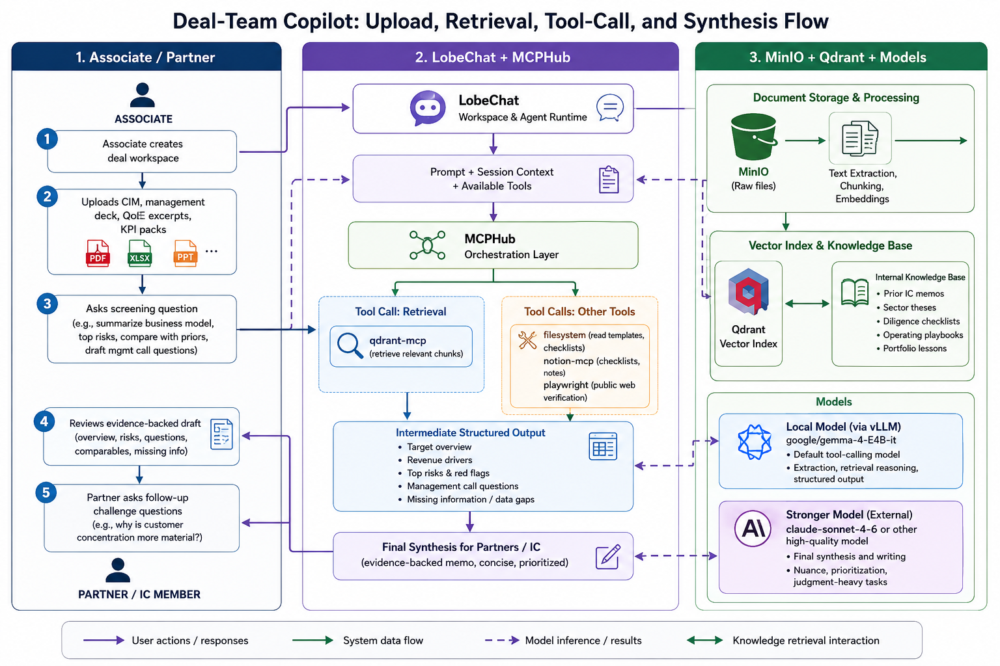
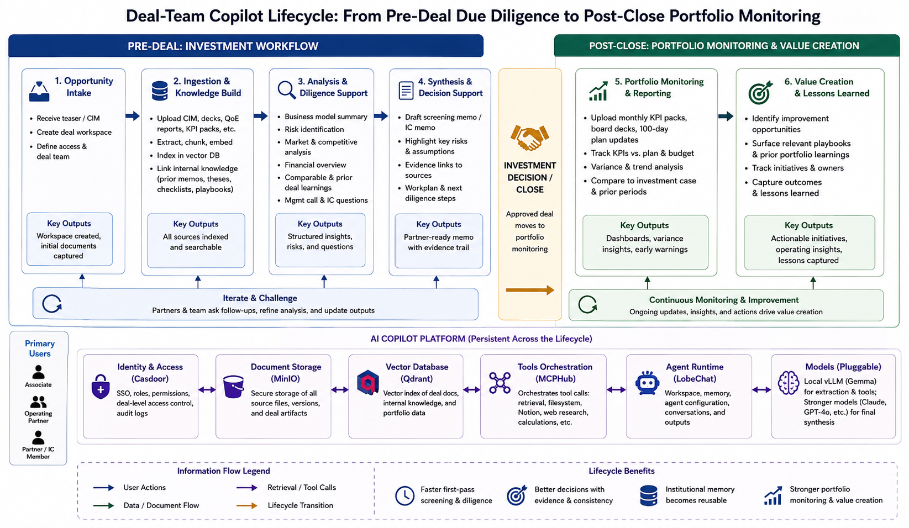

# Q1 — Use case design

## Context

I would apply this stack to a private-equity workflow like the one I saw at Auctus in Munich. The most realistic use case is a deal-team copilot for screening new opportunities and accelerating first-pass due diligence, with portfolio monitoring as a later extension. This is a vertical-specific problem because private equity runs on confidential, fragmented, time-sensitive information: teasers, CIMs, management presentations, QoE reports, customer analyses, legal diligence, KPI packs, operating-partner notes, prior IC memos, and internal sector theses. Most of that information sits in PDFs, spreadsheets, shared folders, and note systems rather than in one clean application.

The problem is not a lack of intelligence but a lack of retrieval, consistency, and speed. Associates repeatedly extract the same facts from PDFs, compare a target against old deals, rebuild management-call question lists, and rewrite similar risk summaries for different partners. Meanwhile, much of the firm's institutional memory is trapped in old memos or in the heads of a few people. For a mid-sized PE firm, that creates both wasted time and inconsistent early conclusions.

The goal is therefore not to "replace diligence," which would be unrealistic and risky, but to reduce the mechanical part of deal work while improving the reuse of firm knowledge. In measurable terms, I would target:

- reducing first-pass deal screening memo preparation from roughly one working day to 2-3 hours;
- reducing management-call and IC-question preparation time by at least 50%;
- making prior deal knowledge reusable instead of buried in folders;
- creating a controlled environment for highly confidential deal material instead of pasting it into a generic SaaS chatbot.

This fits the repo well because the stack is not just a chatbot. It combines LobeChat as the agent runtime, Casdoor for identity, MinIO for document storage, Qdrant for retrieval, MCPHub for tool orchestration, and pluggable models for different steps in the workflow.

## Personas

The first persona is the Associate. This user lives inside CIMs, expert-call notes, KPI exports, and old IC decks. Their workflow is document-heavy and deadline-driven. Their main pain points are extracting comparable facts from messy sources, turning raw material into partner-ready structure, and not missing obvious diligence questions because they did not find the right prior memo in time.

The second persona is the Operating Partner or portfolio support lead. This user does not want a generic summary; they want an operational view. They care about pricing power, procurement savings, sales-force productivity, plant utilization, ERP readiness, and whether management's improvement plan is credible. Their pain point is that operational lessons learned in earlier portfolio companies are rarely accessible in a structured way during a new diligence process.

The third persona is the Partner or Investment Committee member. This user is not reading every source file. They want a concise answer to questions such as: What is the core underwriting risk? Which management claims are weakly supported? Which diligence workstreams matter most before LOI or signing? Their pain point is not information scarcity but signal quality. They need short outputs that are evidence-backed and challengeable.

## Journey

The journey starts when the Associate creates a dedicated workspace or agent in LobeChat for a live deal. Access is authenticated through Casdoor, which matters because the material is highly confidential and should sit behind the firm's own identity layer.

Step 1 is ingestion. The Associate uploads the CIM, management presentation, QoE excerpts, and KPI packs into LobeChat. Raw files are stored in MinIO, and the relevant text is chunked, embedded, and indexed in Qdrant. The firm's pre-existing internal knowledge base can also sit in Qdrant: prior IC memos, sector maps, diligence checklists, and operating playbooks. The value does not come only from summarizing today's PDF; it comes from retrieving today's deal against the firm's accumulated internal evidence.

Step 2 is first-pass screening. The Associate asks: "Summarize the business model, identify the top five underwriting risks, compare them with similar past situations, and draft questions for the management call." LobeChat sends the prompt, session context, and available tool list to the model. For this stage I would use the local `google/gemma-4-E4B-it` model via vLLM as the default tool-calling model because it is good enough for structured extraction and cheaper to use repeatedly than a premium frontier model.

Step 3 is retrieval and tool use through MCPHub. This is where the stack becomes meaningfully different from plain chat. The model can trigger:

- `qdrant-mcp` to retrieve relevant chunks from the uploaded deal documents and from prior internal materials;
- `filesystem` to read local templates such as the firm's IC memo structure or a standard diligence question list;
- `notion-mcp` if the firm keeps live checklists, portfolio initiatives, or meeting notes in Notion;
- `playwright` in limited cases to inspect a public company website, product page, or press release when the Associate wants to test a market claim against public evidence.

The data flow is precise. LobeChat routes tool calls to MCPHub, MCPHub dispatches them to the right MCP server, and the result comes back into the LLM loop as tool output. Meanwhile, chat state and agent configuration are stored in Postgres, so the reasoning trail remains persistent across sessions.

Step 4 is evidence-backed synthesis. The tool-calling model assembles a structured intermediate output: target overview, revenue drivers, red flags, missing information, and a first draft of a management question list. For the final partner-facing note, I would switch to a stronger model already supported by the stack, such as `claude-sonnet-4-6` or another high-quality OpenAI-compatible model. A lower-cost local model handles repetitive extraction and tool use; a stronger model handles the final writing step where nuance and prioritization matter more.

Step 5 is challenge and iteration. The Partner or IC member can ask follow-up questions such as: "Why is customer concentration a more material risk than cyclicality?" or "Which margin-improvement assumptions depend too much on management guidance?" Because the answers are grounded in retrieved material from Qdrant and linked internal documents, the Associate can challenge the AI and refine the output instead of accepting a black-box answer. In PE, the system should accelerate critical thinking, not replace it.

Step 6 is post-deal extension. If the deal closes, the same workspace can continue into portfolio monitoring. Monthly KPI packs, board decks, and value-creation updates can be uploaded to MinIO and indexed into Qdrant. The Operating Partner can then ask the agent to compare current performance against the original investment case or the 100-day plan. That turns the stack from a one-off diligence assistant into a reusable operating asset.

The measurable value comes from both time savings and better consistency. I would expect the Associate to save 6-8 hours on a first-pass memo, 1-2 hours on management-call preparation, and additional time whenever the team needs to revisit old theses or portfolio lessons. Just as importantly, the firm gets a more repeatable evidence chain: source files in MinIO, retrieval in Qdrant, tool calls through MCPHub, and decision-oriented output in LobeChat.

*Figure 1. Step-by-step workflow from document upload and retrieval to tool calls, intermediate outputs, and final synthesis for partners and the IC.*

## Why this stack vs ChatGPT/Copilot

The first reason is tool-connected workflow depth. ChatGPT Enterprise or Microsoft Copilot can summarize a file, but this use case needs one agent runtime that can pull from uploaded deal documents, retrieve from an internal vector database, read local templates, optionally query Notion, and preserve conversation history. MCPHub is what turns the system from "chat over one document" into a controlled orchestration layer over multiple private data sources and tools.

The second reason is confidentiality and control. Private-equity deal work often includes highly sensitive materials: seller data, customer concentration, pricing assumptions, and preliminary investment views. In this stack, authentication runs through Casdoor, raw files live in MinIO, retrieval happens in Qdrant, and the firm decides which models are allowed for which tasks. That is better aligned with confidential deal work than relying on a horizontal SaaS tool where the workflow is largely defined by the vendor.

The third reason is model flexibility and cost discipline. Private equity work is bursty. A firm should not pay premium-model cost for every extraction task. This stack allows a practical split: use local vLLM with Gemma for repetitive first-pass work, and reserve a stronger external model for the final memo or the hardest synthesis tasks.

The fourth reason is institutional memory as a proprietary asset. A generic SaaS assistant mainly gives access to a strong model. This stack lets the firm gradually build a reusable internal corpus of prior memos, diligence frameworks, operating playbooks, and portfolio lessons. In private equity, that matters because the real edge is often accumulated pattern recognition. Qdrant plus LobeChat agents make that memory queryable.

So my conclusion is that this stack is valuable for Auctus not because it is "an AI chatbot," but because it can become a deal-team workbench: secure, tool-connected, model-flexible, and grounded in the firm's own evidence. In a sector where information is sensitive and judgment depends heavily on prior experience, that is a more defensible advantage than using a generic assistant alone.

*Figure 2. The same architecture can support the full lifecycle, from pre-deal screening and diligence to post-close portfolio monitoring and value creation.*
