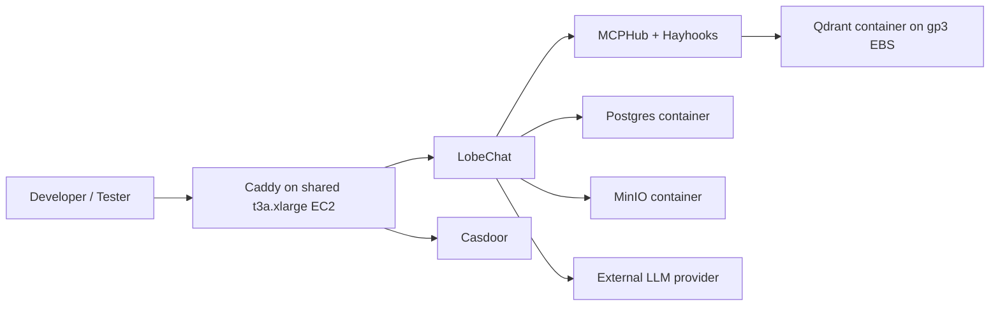
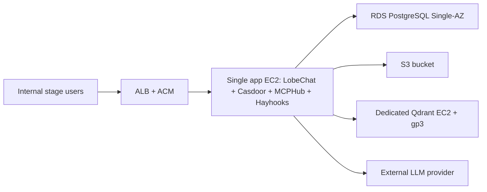
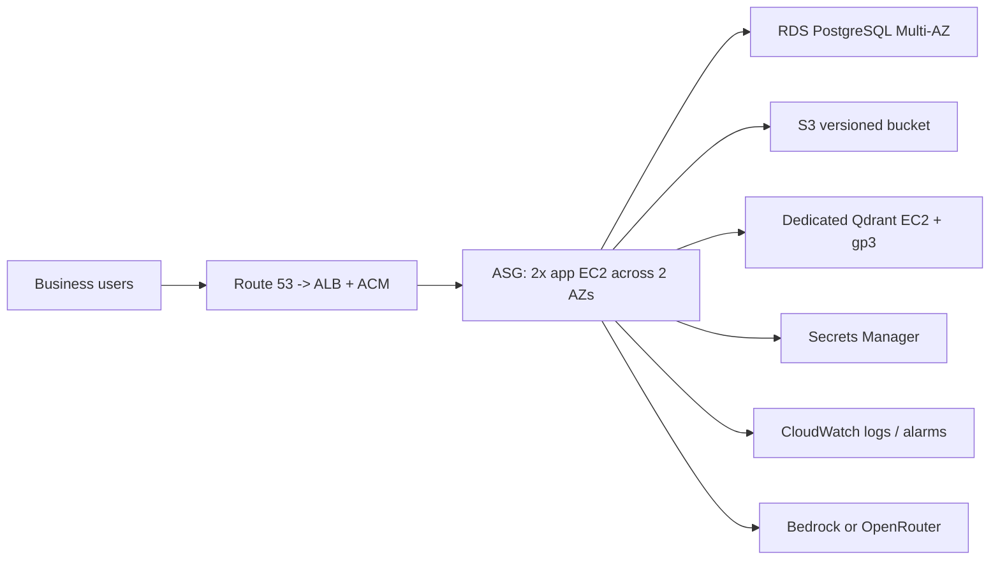

# Q2 — 3-environment architecture evolution

## Per-environment component table

I would not scale this stack by making every component managed at once. The current repo is a single-EC2, Docker Compose deployment, so the right evolution is to keep the app tier close to that baseline while externalizing the components that benefit most from AWS-managed reliability: PostgreSQL, object storage, TLS, secrets, and observability. Qdrant is the explicit exception because it must stay on EC2.

| Component | Dev | Stage | Prod |
|---|---|---|---|
| LobeChat | Shared `t3a.xlarge` EC2, Docker Compose | Single `t3a.xlarge` app EC2 behind ALB | Two `m6i.large` app EC2 in ASG behind ALB |
| Casdoor | Same shared EC2 as LobeChat | Same stage app EC2 | Same app ASG nodes; stateless, backed by RDS |
| Postgres | Container on shared dev EC2 | Amazon RDS PostgreSQL, Single-AZ | Amazon RDS PostgreSQL, Multi-AZ |
| MinIO | MinIO container on shared dev EC2 | Replaced by S3 bucket | Replaced by S3 bucket with versioning |
| Qdrant | Qdrant container on dev EC2 with attached gp3 volume | Dedicated `t3.large` EC2 with gp3 volume | Dedicated `m6i.xlarge` EC2 with gp3 volume |
| MCPHub | Same shared dev EC2 | Same stage app EC2 | Same app ASG nodes |
| Hayhooks | Same shared dev EC2 | Same stage app EC2 | Same app ASG nodes |
| vLLM / LLM provider | No GPU; use external provider for cost | External provider; same API path as prod | Bedrock or OpenRouter primary, optional second provider for fallback |

The logic is deliberate. Dev optimizes for low cost and fast iteration, so almost everything stays on one box. Stage introduces the production-shaped boundaries that matter most: managed Postgres, managed object storage, managed TLS, and a dedicated Qdrant node. Prod then scales the stateless app tier horizontally and keeps stateful data on managed services where possible.

## Qdrant on EC2 — sizing, snapshots, recovery

Qdrant is the one component I would keep on EC2 in all three environments because the assignment explicitly forbids using a managed vector database. I would therefore treat it as a first-class stateful service rather than an afterthought hidden inside the app instance.

In dev, Qdrant can stay on the shared app EC2, but its storage should still live on a dedicated 100 GiB gp3 EBS volume mounted into the container path. That keeps the recovery pattern similar to higher environments. Nightly EBS snapshots are enough, and a failed dev node can simply be rebuilt from the latest snapshot or reindexed.

In stage, I would move Qdrant to a dedicated `t3.large` EC2 with a 200 GiB gp3 volume. Stage is where restore procedures should be tested, so I would take a snapshot before each release candidate deployment and at least one scheduled snapshot per day. I would also keep a documented restore runbook: launch a replacement instance, attach or restore the volume, remount, and restart the container.

In prod, I would use a dedicated `m6i.xlarge` EC2 with a 500 GiB gp3 volume. The sizing is driven less by CPU spikes than by vector index memory pressure, cache locality, and the need to avoid constantly reloading collections. I would snapshot the volume every 4 hours, keep daily snapshots for 35 days, and create a pre-deploy snapshot before any schema or embedding-model change. Recovery would rely on three controls: CloudWatch recovery alarm for host failure, private Route 53 DNS name for the Qdrant endpoint, and a tested rebuild path that restores the latest good EBS snapshot onto a replacement instance. I would prefer this over a complex multi-node cluster for the course project because it offers a much better reliability-to-ops ratio.

## AWS managed services in prod

Prod should use at least these AWS managed services:

- `Application Load Balancer`: public ingress for `app` and `auth` hostnames, health checks, and TLS termination.
- `AWS Certificate Manager`: certificate lifecycle for HTTPS without running Let's Encrypt on the instances.
- `Route 53`: public DNS for the application hostnames and private DNS for internal names such as Qdrant.
- `Amazon RDS for PostgreSQL`: durable relational store for LobeChat and Casdoor with Multi-AZ failover.
- `Amazon S3`: object storage replacing MinIO, with versioning for uploaded files and generated artifacts.
- `AWS Secrets Manager`: per-environment secrets, rotated independently of code.
- `Amazon CloudWatch`: logs, metrics, alarms, and EC2 recovery actions.

If the model provider is AWS Bedrock, that becomes an eighth managed service and avoids self-managed GPU inference.

## Promotion flow

I would keep one codebase and promote the same artifact across environments rather than rebuilding environment-specific variants.

1. Developers work on short-lived feature branches and open a pull request into `main`.
2. Merge to `main` deploys automatically to dev using the dev CloudFormation parameters and dev secrets.
3. A release-candidate tag such as `v1.4.0-rc1` promotes the exact same container/image revision to stage.
4. Stage runs smoke tests: login, streaming chat, one MCP tool call, one file upload, one Qdrant retrieval, and one restore drill on a non-live dataset.
5. Production deployment happens only from a version tag such as `v1.4.0`, after manual approval from both the application owner and the platform owner.

Infrastructure and config should follow the same promotion path. CloudFormation templates stay identical where possible; only parameter files, secrets, instance sizes, and scaling policies differ by environment. Database migrations run in stage before prod. No direct hotfixes are made in prod without back-porting them to `main`, otherwise the environments drift immediately.

## Data strategy

Dev should use realistic-but-safe data: masked IC memos, redacted CIM excerpts, synthetic KPI packs, and fake user identities. The goal is to preserve structure, document length, and query patterns without exposing real deal material.

Stage should mirror prod behavior, not prod sensitivity. I would therefore use the same service boundaries as prod, but load only anonymized or redacted documents plus a scrubbed metadata snapshot. Stage is where I validate restore, auth flows, and search quality against production-like schemas.

Prod needs a layered backup strategy. RDS gets automated backups and point-in-time recovery. S3 gets versioning and lifecycle rules. Qdrant gets scheduled EBS snapshots and a tested restore runbook. Secrets Manager preserves version history for key rollback. The important principle is that "backed up" is not enough; each stateful component needs a documented restore target and a regular recovery test.

## Trade-off table

Scores below use `1 = weak` and `5 = strong`.

| Environment | Reliability | Cost efficiency | Ops simplicity | Why |
|---|---:|---:|---:|---|
| Dev | 2 | 5 | 5 | Cheapest and easiest, but many components share one blast radius |
| Stage | 4 | 3 | 3 | Closer to prod and good for validation, but deliberately pays some redundancy tax |
| Prod | 5 | 2 | 2 | Highest resilience and control, but more services and more operational coordination |

## Reverse-proxy / TLS choice

I would use two different ingress patterns on purpose.

In dev, I would keep the repo's current approach: self-managed Caddy on the EC2 instance plus an `sslip.io` hostname. It is cheap, fast to iterate on, and fully adequate for a single shared box. It also matches the practical deployment already implemented in this repo.

In stage and prod, I would move to `ALB + ACM + Route 53`. The reason is not only scale; it is operational burden. Once an environment becomes shared or business-facing, I do not want certificate renewal, host routing, and public health exposure to depend on a containerized reverse proxy on one instance. ALB also gives cleaner separation between public ingress and private service ports.

I considered CloudFront, but I would reject it here. The app depends on login redirects, streaming responses, MCP-related long-lived connections, and file uploads. CloudFront can support that, but for this stack it adds caching and origin-hardening complexity without solving a pressing problem that ALB does not already solve more simply.

## Architecture diagrams

Mermaid source is also saved under `assets/dev.mmd`, `assets/stage.mmd`, and `assets/prod.mmd`.

### Dev

### Stage

### Prod

